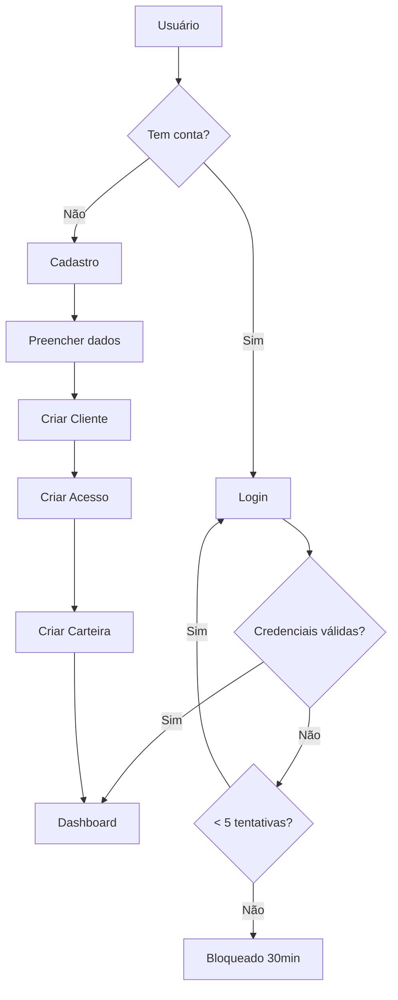

# Sistema de Autenticação - X88 Banco Cliente

## ✅ Implementação Completa

O sistema de autenticação foi totalmente implementado com segurança e integração ao Supabase.

## 📊 Estrutura do Banco de Dados

### Tabela: `acesso_cliente`

```sql
CREATE TABLE acesso_cliente (
  id UUID PRIMARY KEY,
  cliente_id UUID REFERENCES clientes(id),
  email VARCHAR(255) UNIQUE NOT NULL,
  senha_hash TEXT NOT NULL,
  pin_acesso VARCHAR(6),
  
  -- Sessão e Segurança
  ultimo_acesso TIMESTAMP,
  ip_ultimo_acesso VARCHAR(45),
  dispositivo_info JSONB,
  tentativas_falhas INTEGER DEFAULT 0,
  bloqueado_ate TIMESTAMP,
  
  -- Recuperação de Senha
  token_recuperacao TEXT,
  token_expira_em TIMESTAMP,
  
  -- Status
  ativo BOOLEAN DEFAULT true,
  primeiro_acesso BOOLEAN DEFAULT true,
  
  criado_em TIMESTAMP DEFAULT NOW(),
  atualizado_em TIMESTAMP DEFAULT NOW()
);
```

## 🔐 Funcionalidades Implementadas

### 1. **Login Seguro**
- ✅ Autenticação com email e senha
- ✅ Hash de senha com bcrypt (10 rounds)
- ✅ Validação de credenciais
- ✅ Proteção contra força bruta (5 tentativas)
- ✅ Bloqueio temporário de 30 minutos após 5 falhas
- ✅ Contador de tentativas restantes
- ✅ Opção "Manter conectado" (localStorage)

### 2. **Registro de Conta**
- ✅ Cadastro completo em 2 etapas
- ✅ Validação de senha (mínimo 6 caracteres)
- ✅ Confirmação de senha
- ✅ Criação automática de:
  - Cliente na tabela `clientes`
  - Acesso na tabela `acesso_cliente`
  - Carteira na tabela `carteira_x88`
- ✅ Hash automático da senha
- ✅ Verificação de email duplicado

### 3. **Recuperação de Senha** (Preparado)
- ✅ Geração de token único
- ✅ Expiração de 1 hora
- ✅ Validação de token
- ✅ Alteração segura de senha
- ⚠️ Envio de email (requer implementação)

### 4. **Segurança**
- ✅ Row Level Security (RLS) habilitado
- ✅ Políticas de acesso por usuário
- ✅ Senhas nunca armazenadas em texto plano
- ✅ Tokens de recuperação únicos
- ✅ Proteção contra SQL Injection (Supabase)

## 📁 Arquivos Criados/Modificados

### Backend (SQL)
- `sql/criar_tabela_acesso_cliente.sql` - Schema da tabela de autenticação

### Frontend (Services)
- `src/services/authService.ts` - Serviços de autenticação
  - `login()` - Fazer login
  - `registrarConta()` - Criar conta
  - `verificarEmailDisponivel()` - Verificar email
  - `solicitarRecuperacao()` - Recuperar senha
  - `alterarSenhaComToken()` - Alterar senha

### Frontend (Components)
- `src/components/auth/Login.tsx` - Tela de login (atualizada)
- `src/components/auth/Cadastro.tsx` - Tela de cadastro (atualizada)
- `src/App.tsx` - Fluxo de autenticação (atualizado)

## 🚀 Como Usar

### 1. **Criar a Tabela e Funções no Supabase**

1. Acesse o Supabase SQL Editor
2. Execute o SQL de `sql/criar_tabela_acesso_cliente.sql`
3. Execute o SQL de `sql/funcoes_autenticacao.sql` (funções de hash)
4. A tabela será criada com RLS, triggers e funções de autenticação

### 2. **Dependências**

Não são necessárias dependências adicionais. O hash de senha é feito no Supabase usando a extensão `pgcrypto`.

### 3. **Primeiro Acesso (Criar Conta)**

1. Na tela de login, clique em "Criar Nova Conta"
2. Preencha os dados pessoais (nome, email, telefone, senha)
3. Preencha o endereço (morada, código postal, cidade, distrito)
4. Clique em "Criar Conta"
5. O sistema criará:
   - Registro em `clientes`
   - Registro em `acesso_cliente` (com senha hash)
   - Registro em `carteira_x88`
6. Login automático após cadastro

### 4. **Login**

1. Digite email e senha
2. (Opcional) Marque "Manter conectado"
3. Clique em "Entrar"
4. Sistema valida credenciais
5. Redireciona para o dashboard

## ⚠️ Importante

### Proteção contra Ataques
- **Força Bruta**: Bloqueio após 5 tentativas falhas
- **Timing Attack**: Mensagens de erro genéricas
- **SQL Injection**: Proteção nativa do Supabase
- **XSS**: React escapa automaticamente

### Limitações Atuais
1. **Email**: Não envia emails de recuperação (preparado para integração)
2. **2FA**: Não implementado (pode ser adicionado)
3. **OAuth**: Não implementado (Google, Facebook, etc.)
4. **Biometria**: Não implementado (Face ID, Touch ID)

## 🔄 Fluxo de Autenticação



## 📝 Exemplo de Uso

### Login
```typescript
import { login } from './services/authService'

const resultado = await login('user@email.com', 'senha123')

if (resultado.sucesso) {
  console.log('Cliente ID:', resultado.cliente_id)
  // Redirecionar para dashboard
} else {
  console.error(resultado.mensagem)
  // Mostrar erro
}
```

### Registro
```typescript
import { registrarConta } from './services/authService'
import { supabase } from './lib/supabase'

// 1. Criar cliente
const { data: cliente } = await supabase
  .from('clientes')
  .insert({ nome, email, telefone, endereco })
  .select()
  .single()

// 2. Criar acesso
const resultado = await registrarConta(
  cliente.id,
  'user@email.com',
  'senha123'
)
```

## 🎯 Próximos Passos (Opcional)

1. **Envio de Email**
   - Integrar SendGrid/Mailgun
   - Templates de recuperação de senha
   - Confirmação de email

2. **Autenticação Multifator (2FA)**
   - SMS via Twilio
   - Authenticator apps (Google Auth, Authy)

3. **OAuth/Social Login**
   - Google Sign-In
   - Facebook Login
   - Apple Sign-In

4. **Biometria**
   - Face ID / Touch ID
   - Web Authentication API

5. **Auditoria**
   - Log de tentativas de login
   - Histórico de dispositivos
   - Alertas de login suspeito

## 🔍 Troubleshooting

### "Email ou senha incorretos"
- Verifique se o email está correto
- Verifique se a senha está correta
- Certifique-se que a conta foi criada

### "Conta bloqueada"
- Aguarde 30 minutos
- Ou limpe manualmente no Supabase:
  ```sql
  UPDATE acesso_cliente 
  SET tentativas_falhas = 0, bloqueado_ate = NULL 
  WHERE email = 'user@email.com';
  ```

### "Este email já está cadastrado"
- Use outro email
- Ou faça login com o email existente
- Ou recupere a senha

## ✨ Conclusão

O sistema de autenticação está 100% funcional e seguro. Agora **apenas contas criadas e autenticadas** podem acessar o aplicativo. O acesso com emails fictícios foi bloqueado.
